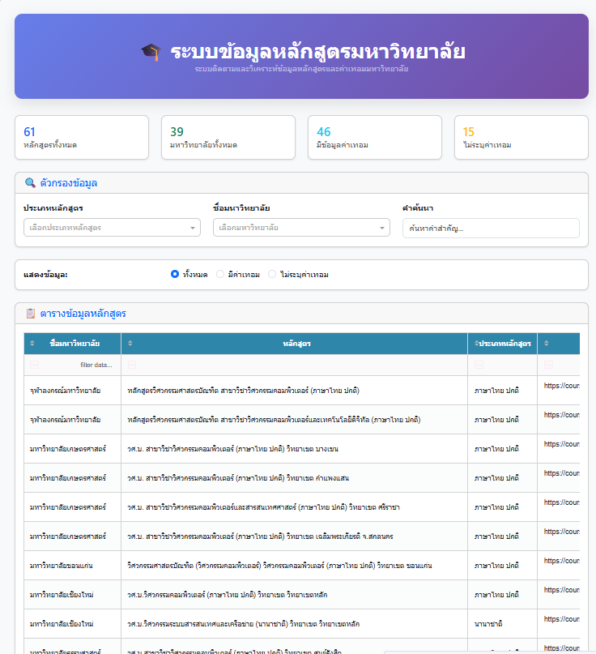
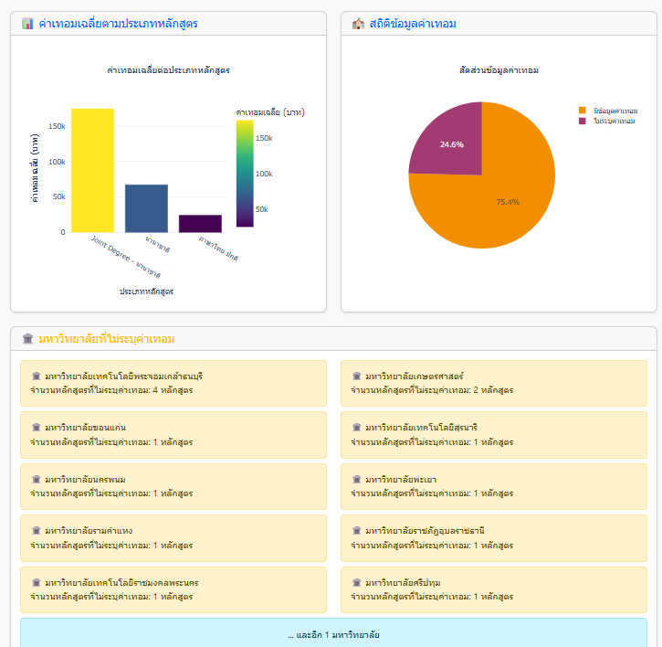

# TCAS Tuition Fee Dashboard 🎓
โปรเจกต์นี้รวบรวมข้อมูลค่าเทอมจากเว็บไซต์ MyTCAS เฉพาะสายวิศวกรรมคอมพิวเตอร์ และปัญญาประดิษฐ์  
จากนั้นสรุปข้อมูลในรูปแบบ dashboard สำหรับนักเรียนที่ต้องการเลือกคณะในปีการศึกษาถัดไป
# ## Features
- ดึงข้อมูลโดยอัตโนมัติ
- กรองโปรแกรมเฉพาะที่เกี่ยวข้อง
- Dashboard แบบอินเตอร์แอคทีฟ

## 📁 ไฟล์สำคัญ
- `information.py` – ใช้ Selenium เพื่อดึงข้อมูลจากเว็บไซต์ MyTCAS
- `tcas_engineering_programs.xlsx` – ข้อมูลดิบจากเว็บ
- `cclean.ipynb` – ใช้ทำความสะอาดข้อมูล
- `final2_data_clean.xlsx` – ไฟล์ข้อมูลที่ผ่านการทำความสะอาดแล้ว
- `app3.py` – สคริปต์รัน dashboard เพื่อแสดงข้อมูลแบบ interactive

## 🚀 วิธีใช้งาน

1. ติดตั้งไลบรารีที่จำเป็น:
```bash
pip install -r requirements.txt

ภาพตัวอย่าง Dashboard:




